

  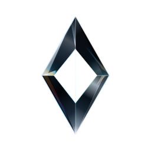

  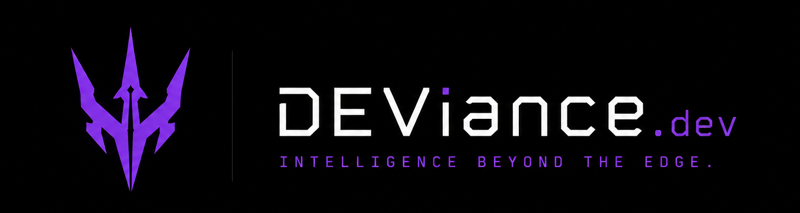

  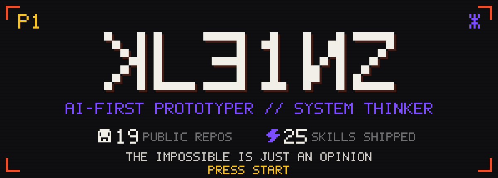

# Max Kleinz

I made records for two decades. Now I build machines that think in code.
Same job: press record, keep what's true, cut the rest.

I'm a prototyper. Ideas hit in bursts and I ship them raw, on purpose.
Half of this never reached a finish line — that's the point. Every repo
says what works, what doesn't, where I stopped. Take one and run.
Nobody builds anything alone.

**DEViance Intelligence** — *beyond the edge*. No roadmap, no pitch.
The repos are the pitch.

## ▞▞ Now playing — fresh from the repos

Auto-sorted by last push · refreshed daily by a scheduled action · the flame means pushed this week.

<!-- now-playing:start -->

<a href="https://github.com/maxkle1nz/temponizer-paper"></a>
<a href="https://github.com/maxkle1nz/synt0ny"></a>

<a href="https://github.com/maxkle1nz/deviance-skills"></a>
<a href="https://github.com/maxkle1nz/thebridge"></a>

<a href="https://github.com/maxkle1nz/almus"></a>
<a href="https://github.com/maxkle1nz/l00p"></a>

<!-- now-playing:end -->

---

## ▞▞ Systems I maintain

<table>
  <tr>
    <td width="34" align="center"></td>
    <td><a href="https://github.com/maxkle1nz/m1nd"><b>m1nd</b></a></td>
    <td>Structural truth for coding agents, so they navigate the codebase instead of guessing it.</td>
  </tr>
  <tr>
    <td align="center"></td>
    <td><a href="https://github.com/maxkle1nz/war-room"><b>war-room</b></a></td>
    <td>AI that argues back. Multi-agent decisions with a built-in devil's advocate.</td>
  </tr>
  <tr>
    <td align="center"></td>
    <td><a href="https://github.com/maxkle1nz/banned-by-anthropic-public"><b>BANNED&nbsp;BY&nbsp;ANTHROPIC</b></a></td>
    <td>Independent public record for Claude and Anthropic account lockouts.</td>
  </tr>
</table>

## ▞▞ The lab — open prototypes

<table>
  <tr>
    <td width="34" align="center"></td>
    <td><a href="https://github.com/maxkle1nz/temponizer-paper"><b>temponizer-paper</b></a></td>
    <td>AI agents don't know how fast they are. A paper that measures the gap.</td>
  </tr>
  <tr>
    <td align="center"></td>
    <td><a href="https://github.com/maxkle1nz/synt0ny"><b>synt0ny</b></a></td>
    <td>The geometry of meaning in local embeddings, measured under sealed pre-registrations.</td>
  </tr>
  <tr>
    <td align="center"></td>
    <td><a href="https://github.com/maxkle1nz/v1truvio"><b>v1truvio</b></a></td>
    <td>Not a design system; the compiler that generates them.</td>
  </tr>
  <tr>
    <td align="center"></td>
    <td><a href="https://github.com/maxkle1nz/l00p"><b>l00p</b></a></td>
    <td>Opus orchestrates, Codex executes, a deterministic gate closes the loop.</td>
  </tr>
  <tr>
    <td align="center"></td>
    <td><a href="https://github.com/maxkle1nz/almus"><b>almus</b></a></td>
    <td>Agent-first CSS design system. The vocabulary is a written contract.</td>
  </tr>
  <tr>
    <td align="center"></td>
    <td><a href="https://github.com/maxkle1nz/thebridge"><b>thebridge</b></a></td>
    <td>The AI access you already have, behind one local OpenAI-compatible surface.</td>
  </tr>
  <tr>
    <td align="center"></td>
    <td><a href="https://github.com/maxkle1nz/pathos"><b>pathos</b></a></td>
    <td>Continuity protocol for long human+agent sessions.</td>
  </tr>
  <tr>
    <td align="center"></td>
    <td><a href="https://github.com/maxkle1nz/Brotherizer"><b>Brotherizer</b></a></td>
    <td>The rewrite engine that gives LLM text a pulse.</td>
  </tr>
</table>

Every README says what's real. Fork what you want.

## ▞▞ Skills — the method, packaged

<table>
  <tr>
    <td width="34" align="center"></td>
    <td><a href="https://github.com/maxkle1nz/deviance-skills"><b>deviance-skills</b></a></td>
    <td>The operating doctrine my agents carry, for Claude Code and Codex — twelve skills that survived daily use: counterpoint, proof-first building, session continuity, repo health, security truth, git hygiene. One ships with its own blind A/B evidence.</td>
  </tr>
</table>

Two and a half years of this, every single day. I forgot what losing a day
to a bug feels like — it's all in the pack.

## ▞▞ Story mode

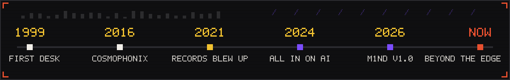

## ▞▞ Sound test — the other studio


Before agents, consoles. Some of those records went platinum. Not the point —
the point is compression, headroom, what survives the master. It was systems
training all along. The other studio: [cosmophonix.com](https://cosmophonix.com).

## ▞▞ Continue? — contact

<a href="https://github.com/maxkle1nz/maxkle1nz/issues/new?template=contact.yml">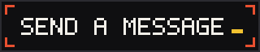</a>

Opens a public issue. Private channel: kleinz@cosmophonix.com

---

  
   
  <a href="https://maxkle1nz.github.io/deviance.dev/"><b>DEViance Intelligence</b></a> — <i>beyond the edge</i> · Cosmophonix · kleinz@cosmophonix.com
   
  <a href="https://x.com/kle1nzzz">X / Twitter</a> · <a href="https://instagram.com/maxkle1nz">Instagram</a>

<!-- ↑ ↑ ↓ ↓ ← → ← → B A — you found it. Mention KONAMI when you write and I will know you read the source. -->
