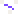
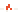

  

  

  

# Max Kleinz

I spent two decades making records. Now I build machines that think in code.
Different tools. Same instinct: press record, keep what's true, cut the rest.

I'm a prototyper. Ideas come in bursts, and I ship them raw on purpose.
Not everything here is polished. Not everything made it to the finish line.
That is part of the point.

Every repo is a trace: what worked, what broke, where I stopped, and where
someone else might begin. Take what you need. Fork what you can. Run with it.
Nobody builds anything alone.

My working framework was forged through trial, error, and a lot of research —
until it reached a shape that feels close to perfect for the way I build.
The system is designed to run autonomously: agents with enough structure,
context, memory, constraints, and feedback to move without waiting for me at
every step. That is the core of my research, especially in **m1nd**: a framework
that gives an agent the essential and deep information it needs to understand
context, architecture, intent, history, and the many other dimensions behind a
codebase before it acts.

**DEViance Intelligence** — *beyond the edge*. No roadmap, no pitch.
The repos are the pitch.

## ▞▞ Now playing — fresh from the repos

Auto-sorted by last push · refreshed daily by a scheduled action · the flame means pushed this week.

<!-- now-playing:start -->

<!-- now-playing:end -->

---

## ▞▞ Systems I maintain

<table>
  <tr>
    <td width="34" align="center"></td>
    <td><a href="https://github.com/maxkle1nz/m1nd"><b>m1nd</b></a></td>
    <td>Context infrastructure for coding agents: repo maps, memory, structure, constraints, and deep project truth before action.</td>
  </tr>
  <tr>
    <td align="center"></td>
    <td><a href="https://github.com/maxkle1nz/deviance-skills"><b>deviance-skills</b></a></td>
    <td>The working doctrine my agents carry: skills forged through daily use, evidence, counterpoint, continuity, and repo health.</td>
  </tr>
  <tr>
    <td align="center"></td>
    <td><a href="https://github.com/maxkle1nz/l00p"><b>l00p</b></a></td>
    <td>Autonomous build loop: orchestration, execution, verification, and a deterministic gate that closes the cycle.</td>
  </tr>
  <tr>
    <td align="center"></td>
    <td><a href="https://github.com/maxkle1nz/v1truvio"><b>v1truvio</b></a></td>
    <td>The compiler for visual systems — not the design system, the machine that generates them.</td>
  </tr>
  <tr>
    <td align="center"></td>
    <td><a href="https://github.com/maxkle1nz/pathos"><b>pathos</b></a></td>
    <td>Continuity protocol for long human+agent sessions, so the thread survives beyond one prompt.</td>
  </tr>
  <tr>
    <td align="center"></td>
    <td><a href="https://github.com/maxkle1nz/banned-by-anthropic-public"><b>BANNED&nbsp;BY&nbsp;ANTHROPIC</b></a></td>
    <td>Independent public record for Claude and Anthropic account lockouts.</td>
  </tr>
</table>

## ▞▞ The lab — open prototypes

<table>
  <tr>
    <td width="34" align="center"></td>
    <td><a href="https://github.com/maxkle1nz/temponizer-paper"><b>temponizer-paper</b></a></td>
    <td>AI agents don't know how fast they are. A paper that measures the gap.</td>
  </tr>
  <tr>
    <td align="center"></td>
    <td><a href="https://github.com/maxkle1nz/synt0ny"><b>synt0ny</b></a></td>
    <td>The geometry of meaning in local embeddings, measured under sealed pre-registrations.</td>
  </tr>
  <tr>
    <td align="center"></td>
    <td><a href="https://github.com/maxkle1nz/v1truvio"><b>v1truvio</b></a></td>
    <td>Not a design system; the compiler that generates them.</td>
  </tr>
  <tr>
    <td align="center"></td>
    <td><a href="https://github.com/maxkle1nz/l00p"><b>l00p</b></a></td>
    <td>Opus orchestrates, Codex executes, a deterministic gate closes the loop.</td>
  </tr>
  <tr>
    <td align="center"></td>
    <td><a href="https://github.com/maxkle1nz/almus"><b>almus</b></a></td>
    <td>Agent-first CSS design system. The vocabulary is a written contract.</td>
  </tr>
  <tr>
    <td align="center"></td>
    <td><a href="https://github.com/maxkle1nz/thebridge"><b>thebridge</b></a></td>
    <td>The AI access you already have, behind one local OpenAI-compatible surface.</td>
  </tr>
  <tr>
    <td align="center"></td>
    <td><a href="https://github.com/maxkle1nz/pathos"><b>pathos</b></a></td>
    <td>Continuity protocol for long human+agent sessions.</td>
  </tr>
  <tr>
    <td align="center"></td>
    <td><a href="https://github.com/maxkle1nz/Brotherizer"><b>Brotherizer</b></a></td>
    <td>The rewrite engine that gives LLM text a pulse.</td>
  </tr>
</table>

Every README says what's real. Fork what you want.

## ▞▞ Skills — the method, packaged

<table>
  <tr>
    <td width="34" align="center"></td>
    <td><a href="https://github.com/maxkle1nz/deviance-skills"><b>deviance-skills</b></a></td>
    <td>The operating doctrine my agents carry, for Claude Code and Codex — thirteen skills that survived daily use: counterpoint, proof-first building, session continuity, repo health, security truth, git hygiene. One ships with its own blind A/B evidence.</td>
  </tr>
</table>

This is the method, packaged: forged in trial and error, pressure-tested by
research and daily shipping, then reduced until the agents can carry it without
me explaining the room every time.

## ▞▞ Story mode

## ▞▞ Sound test — the other studio

Before agents, consoles. Some of those records went platinum. Not the point —
the point is compression, headroom, what survives the master. It was systems
training all along. The other studio: [cosmophonix.com](https://cosmophonix.com).

## ▞▞ Continue? — contact

Opens a public issue. Private channel: kleinz@cosmophonix.com

---

  
   
  <a href="https://maxkle1nz.github.io/deviance.dev/"><b>DEViance Intelligence</b></a> — <i>beyond the edge</i> · Cosmophonix · kleinz@cosmophonix.com
   
  <a href="https://x.com/kle1nzzz">X / Twitter</a> · <a href="https://instagram.com/maxkle1nz">Instagram</a>

<!-- ↑ ↑ ↓ ↓ ← → ← → B A — you found it. Mention KONAMI when you write and I will know you read the source. -->
