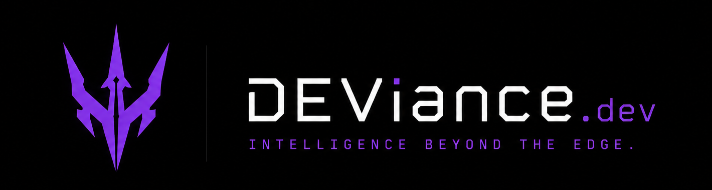
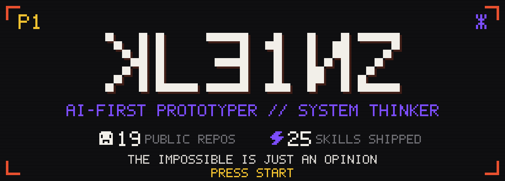
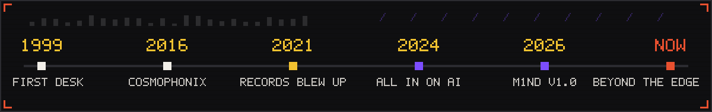
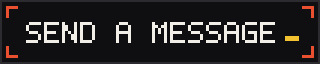

  
  

  
  

  
  

# Max Kle1nz

> **Crunching bits since '99, with an ear addicted to mastering and the feeling of someone who's already been on stage.**
> 

I started coding in the technical high school of Uni Sant'Anna back in 1999. Pure data processing. But life pulled me to the stage and the studio. I was an artist, played in **Hori**, and as a producer I ended up launching artists who hit the top of the charts in Italy. In the end, music and systems are the same thing: it's all about how the parts connect to keep the idea alive.

Today, I'm deep into AI research. I'm not the guy for polished software; I am a **prototyper**. I build the core, prove the thing works, and launch it raw. If the agent doesn't understand the architecture and deep context, it's just an expensive script. I solve this with **m1nd**.

### ▞▞ DEViance Intelligence

I founded **DEViance Intelligence** to be my lab. My pace is one of continuous research and prototyping, so **I'm looking for devs** who want to take control of some of these works, carry on the research I started, and help me build this new generation of systems. 

If you like raw code and aren't afraid of the AI frontier, come along. And if you're a dev and still haven't given in to AI, call me, let's talk and I'll show you how the new tools we're developing can help you not feel like just another boring guy talking about code while everyone else is talking about ideas... come with me.

---

## ▞▞ The Stack

`Assembly` · `C` · `C++` · `Rust` · `Python` · `JS` · `Electron` · `Vite`  

`Scraping Heavy` · `API Discovery` · `Agentic Infrastructure` · `System Thinking`

---

## ▞▞ Systems I maintain

| | [**m1nd**](https://github.com/maxkle1nz/m1nd) | **Flagship.** No more guessing agents: deep context infrastructure and heavy scraping to understand the truth before acting. |

| --- | --- | --- |

| | [**deviance-skills**](https://github.com/maxkle1nz/deviance-skills) | The doctrine of my agents. Skills forged in daily use: proof, continuity and git hygiene. |

| | [**l00p**](https://github.com/maxkle1nz/l00p) | Autonomous build loop. Orchestration and verification with a deterministic gate that closes the loop. |

| | [**v1truvio**](https://github.com/maxkle1nz/v1truvio) |  The compiler for visual systems; not the design system, the machine that generates them. |

---

## ▞▞ Story mode

---

## ▞▞ Sound test | the other studio

27 years between stages and consoles. From **Hori** to the top of the Italian charts. It was real-time systems training: compression, headroom, and what survives the master. The code follows the same technical ruler.

If you like music and a Reggae/Dancehall vibe, check out [**BADMAN**](https://www.youtube.com/watch?v=eVoU_-LA7WY), which I recently produced with **LOWRAH**. It's part of my new artistic project. Music and good vibes, always. ✌️

---

## ▞▞ Continue? | contact

Open a public issue or send an email: kleinz@cosmophonix.com

---

  
  
   
  
  <a href="https://maxkle1nz.github.io/deviance.dev/"><b>DEViance Intelligence</b></a> | <i>beyond the edge</i> · Cosmophonix · kleinz@cosmophonix.com
  
   
  
  <a href="https://x.com/kle1nzzz">X / Twitter</a> · <a href="https://instagram.com/maxkle1nz">Instagram</a>
  

<!-- ⬅ ⬅ ⬅ ⬅ ⬅ ⬅ ⬅ ⬅ B A | you found it. Mention KONAMI when you write and I will know you read the source. -->

