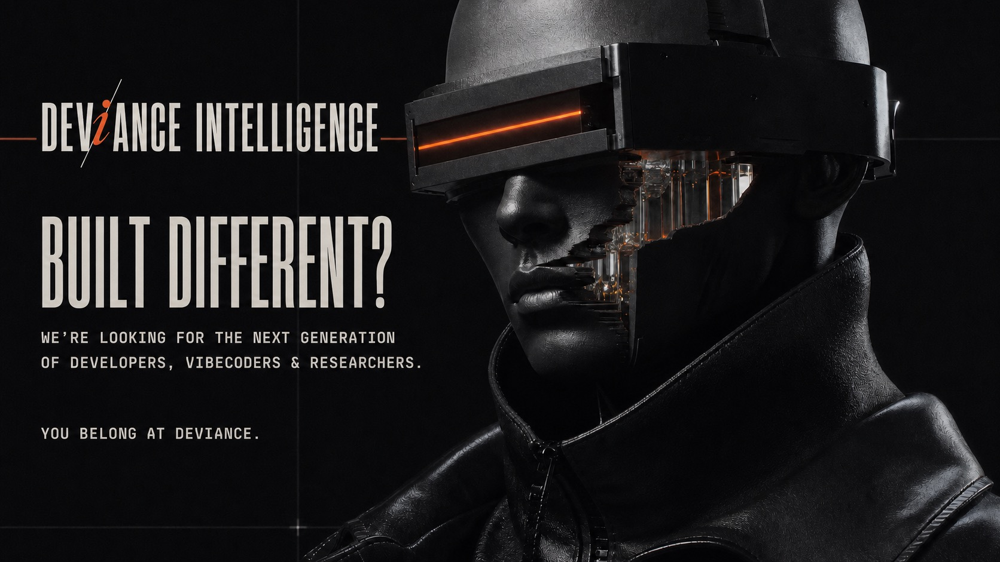
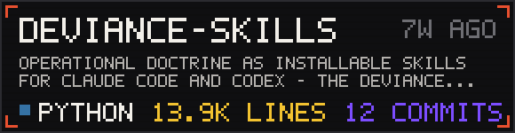
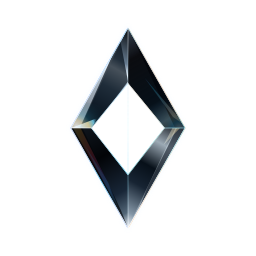

  

# Max Kle1nz

I build the first version that changes the question.

## DEViance Intelligence

**DEViance is a home for the next generation of developers, vibecoders, and
researchers — people who see what could exist and cannot wait for permission to
build it.**

If the normal path never fit you, good.

> ### If you are built different, you belong at DEViance.

We do not care what your title is. We care what you can make real.

| Your signal | What it looks like |
|---|---|
| **Developer** | You see the system and make it survive contact with reality. |
| **Vibecoder** | You turn intent into momentum before the category has a name. |
| **Researcher** | You ask the question that changes the map. |

You may be our kind of person if:

- you can turn a strange idea into a working proof;
- you care more about what survives than what sounds impressive;
- you move between code, research, design, and instinct;
- you leave the work stronger for the next builder.

  <a href="https://deviance.dev"><b>ENTER DEVIANCE</b></a>
  &nbsp;·&nbsp;
  <a href="https://github.com/maxkle1nz/maxkle1nz/issues/new?template=contact.yml"><b>SHOW US WHAT YOU BUILT</b></a>
  &nbsp;·&nbsp;
  <a href="mailto:kleinz@cosmophonix.com"><b>WRITE DIRECTLY</b></a>

---

## Now playing

Real public work, automatically sorted by the latest push.

<!-- now-playing:start -->

<!-- now-playing:end -->

---

## What we are building

| System | The edge |
|---|---|
| [m1nd](https://github.com/maxkle1nz/m1nd) | A neuro-symbolic code graph that gives coding agents structural memory and calibrated trust. |
| [deviance-skills](https://github.com/maxkle1nz/deviance-skills) | Field-tested operating doctrine for Claude Code and Codex. |
| [RETROBUILDER](https://github.com/maxkle1nz/RETROBUILDER) | Software archaeology for hidden coupling, ghost edges, and safer refactors. |
| [v1truvio](https://github.com/maxkle1nz/v1truvio) | A compiler for visual identities with taste, proof, and anti-cliché gates. |
| [synt0ny](https://github.com/maxkle1nz/synt0ny) | Research into the geometry of meaning without an LLM in the hot path. |
| [pathos](https://github.com/maxkle1nz/pathos) | Continuity for long human + agent work. |

No inflated case studies. Open the repositories. Read the code. Find the signal.

## Where I came from

QuakeWorld opened C for me in 1999. Music later taught me compression,
headroom, and what survives the master. I spent years on stages and behind
consoles, from **Hori** to records that reached the top of the Italian charts.

Today the medium is human + agent systems. The work is still the same: connect
the parts so the idea does not die.

---

  
   
  <b>BUILT DIFFERENT? GOOD.</b>
   
  <a href="https://deviance.dev">YOU BELONG AT DEVIANCE.</a>

